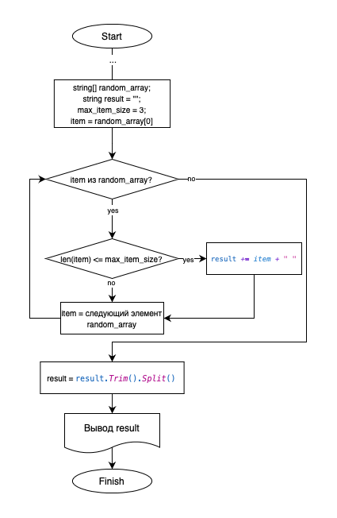
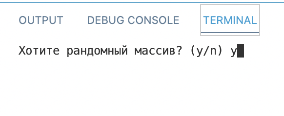
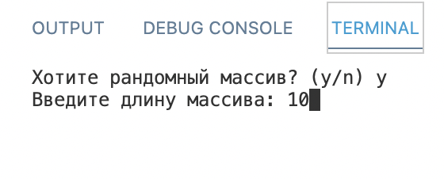
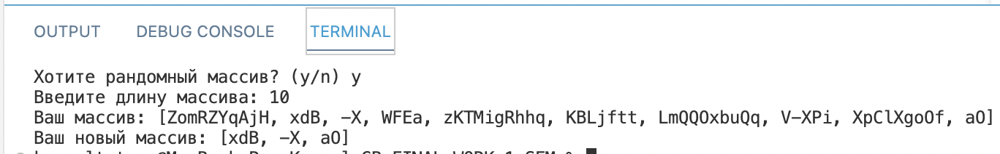
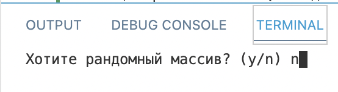
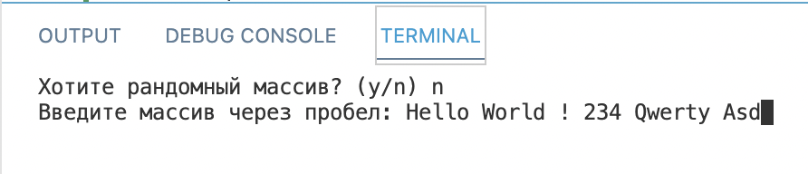
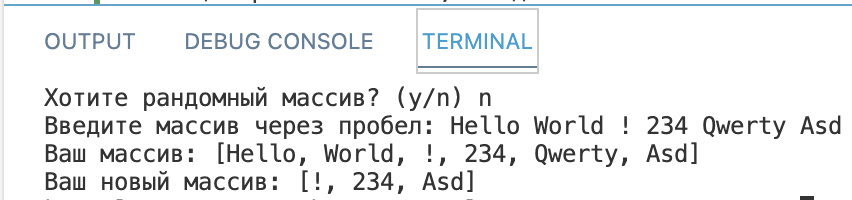
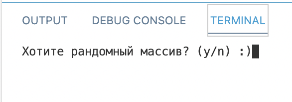
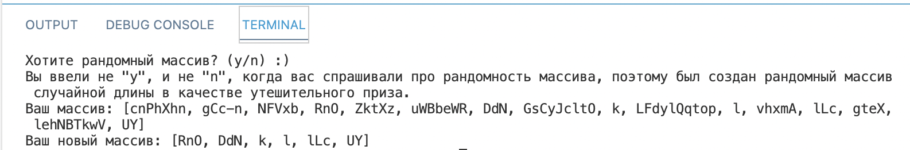

# GB_FINAL_WORK_1_SEM

## Контрольная работа

### Цель работы
Данная работа необходима для проверки ваших знаний и навыков по итогу прохождения первого блока обучения на программе Разработчик. Мы должны убедится, что базовое знакомство с IT прошло успешно.

### Описание задачи
Задача алгоритмически не самая сложная, однако для полноценного выполнения проверочной работы необходимо:

1. Создать репозиторий на GitHub
2. Нарисовать блок-схему алгоритма (можно обойтись блок-схемой основной содержательной части, если вы выделяете её в отдельный метод)
3. Снабдить репозиторий оформленным текстовым описанием решения (файл README.md)
4. Написать программу, решающую поставленную задачу
5. Использовать контроль версий в работе над этим небольшим проектом (не должно быть так, что всё залито одним коммитом, как минимум этапы 2, 3, и 4 должны быть расположены в разных коммитах)

### Формулировка задачи
*Написать программу, которая из имеющегося массива строк формирует новый массив из строк, длина которых меньше, либо равна 3 символам. Первоначальный массив можно ввести с клавиатуры, либо задать на старте выполнения алгоритма. При решении не рекомендуется пользоваться коллекциями, лучше обойтись исключительно массивами.*

### Примеры:
---
> [“Hello”, “2”, “world”, “:-)”] → [“2”, “:-)”]  
> [“1234”, “1567”, “-2”, “computer science”] → [“-2”]  
> [“Russia”, “Denmark”, “Kazan”] → []  
---

## Решение задачи

### Блок схема алгоритма

**Суть алгоритма:** за решение поставленной задачи отвечает метод GetNewStringArray, который по списку строк возвращает новый список строк, каждый элемент которого не более 3 символов длиной.
Проходя по элементам входящего списка циклом foreach, элемент проверяется на соответствие условию. В случае удовлетворения условию, строковой элемент записывается в результующую строку, при этом в конце добавляется пробел. В случае, когда условие не выполняется, цикл переходит к следующему элементу.
В результате будет возвращен список, полученный из результирующей строки (методом **Split()**), из которой будет удалет последний пробел (с помощью метода **Trim()**).  

### Тестирование
#### Сценарий 1: случайный список

#### Сценарий 2: список, введенный из консоли

#### Сценарий 3: вариант, когда пользователь не захотел ответить "y" или "n" на первый вопрос

